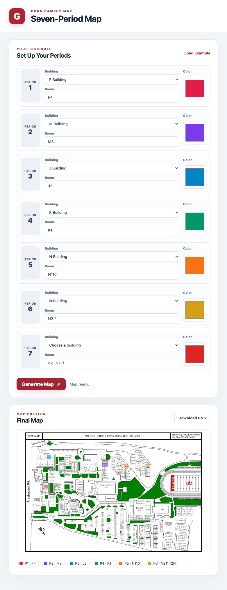

# GunnMap

An unofficial campus map for Henry M. Gunn High School. Browser interactions, the Node.js server, map tools, and tests are written in TypeScript. No Python runtime is required.



## Run

Install Node.js 22 or newer, then:

```sh
npm ci
npm run dev -- --port 8000
```

Open http://127.0.0.1:8000. For a compiled build:

```sh
npm run build
npm start -- --port 8000
```

The server binds to `127.0.0.1` by default. Set `HOST` and `PORT` to configure it. `npm run dev` compiles the browser TypeScript before starting the server. After editing browser code, run `npm run build:web` and reload the page, or restart the development server.

Compiled files live in `dist/`, including the browser modules in `dist/web/`. `npm run build` compiles both the server and browser code; keep the repository's `web/` HTML and CSS, JSON data, and `src/map/` assets alongside that directory when deploying. The browser loads generated JavaScript modules from `/app.js` and `/evacuation.js`.

## Classroom map and evacuation information

Enter a room and color for each of seven periods. A recognized room label or ID automatically selects its building; you can also choose a building manually. Unused slots may remain blank. Generate Map produces a downloadable PNG with individual classroom highlights. Click a classroom, numbered marker, or period chip to see its assembly destination and the corresponding label on the supplied evacuation reference.

Your draft is saved in browser cookies and restored after reload. Clear Schedule clears the draft and preview. Save Current creates a named template; templates can be loaded or deleted. Share Link encodes the seven period selections in the URL so the recipient can load the same schedule. These features use this browser's storage, not a user account or cloud database.

When multiple periods share a room, its highlight is split into color strips for those periods. The downloadable PNG includes a schedule legend. The map keeps its original dimensions so classroom click targets stay aligned.

Period colors and evacuation groups are independent. `n214`, `N214`, and `n-214` resolve to the same second-floor room and the football-field section **N201–N217**. Duplicate K6 labels require their stable R-number. Editing the schedule clears old markers; stale requests are discarded and each render gets an independent image URL so different tabs cannot overwrite each other's maps.

The `/evacuation` page displays the original supplied map with zoom, full-size viewing, and download. The image remains unchanged. Assignments are transcribed in `evacuation_data.json`; `evacuation.ts` deliberately leaves unlisted rooms unconfirmed, including E01 rather than guessing it means E1. This is a reference, not live emergency routing; follow current school staff instructions.

## Data and tools

`room_regions.json` stores the 146 active room polygons and stable IDs, including the N-building second floor. `room_index.csv` lists labels and IDs. The background combines the [district site map](https://resources.finalsite.net/images/v1737500165/pausdorg/zmi9kqvwvpzd975e09bz/GunnSiteMap2025-26.pdf) with the supplied second-floor reference. Editable building regions remain in `building_regions.json`. Original images and the PDF are in `src/map/`. V rooms, Titan Gym, Spangenberg Theater S130, the pool, and most athletic spaces are excluded; the selectable Bow Gym rooms are BG111, BG138, and BG117. Some room boundaries are approximate where the source map has no visible dividing line.

The TypeScript renderer uses Sharp to composite highlights into PNG images. It accepts room labels, IDs, and English inventory aliases such as `library`, `boys`, `yoga`, and `gender neutral`. Two K6 rooms must be addressed by ID.

```sh
npm run highlight -- --rooms output/example.png 'A134=#ff595e' 'B117=#1982c4'
npm run highlight -- output/buildings.png 'A=red' 'Library=blue'
npm run map:index -- output/numbered_room_index.png
npm run map:preview -- output/schedule_preview.png --bow-gym-room BG111
npm run map:validate
npm run map:rebuild
```

`map:rebuild` regenerates the working base PNG from the clean page-one image and the second-floor reference. To inspect a rebuild without replacing the working image, pass an output path. The schedule preview leaves Bow Gym unspecified unless BG111, BG138, or BG117 is explicitly selected.

```ts
import { highlightRooms } from './map_highlighter.js';
await highlightRooms({ A134: '#ff595e', B117: '#1982c4' }, 'output/map.png');
```

## Validation

```sh
npm run typecheck
npm test
npm run build
```

Tests cover room normalization and automatic building selection, N214's football-field destination, explicit range boundaries, unknown assignments, duplicate K6 IDs, multi-color room rendering, PNG legends, independent image URLs, API validation, compiled browser routes, and the browser's draft/template/share and stale-request handling. `npm test` builds the browser modules before running the TypeScript tests. Both the server and browser TypeScript configurations enable strict type checking.
