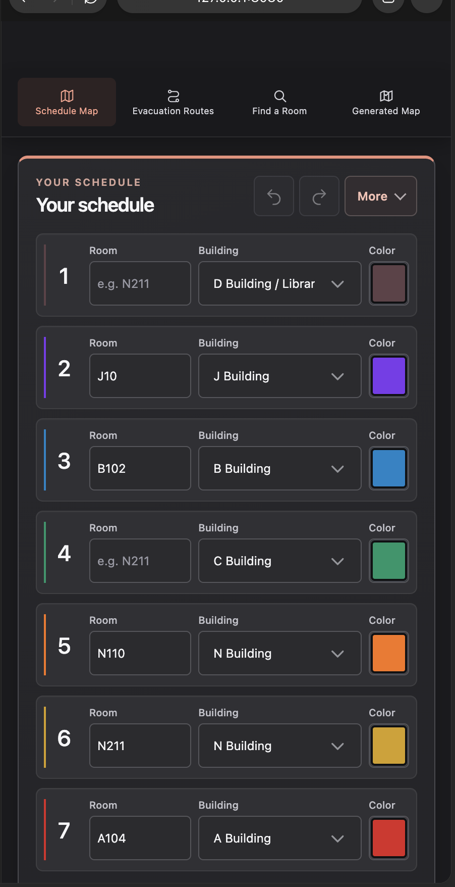

# GunnMap

An unofficial campus map for Henry M. Gunn High School. The browser app, Node.js server, map tools, and checks are written in TypeScript. No Python runtime is required.



## Run

Install Node.js 22 or newer, then:

```sh
npm ci
npm run dev -- --port 8080
```

Open http://127.0.0.1:8080. For a compiled build:

```sh
npm run build
npm start -- --port 8080
```

The server binds to `127.0.0.1` by default. Set `HOST` and `PORT` to configure it. `npm run dev` compiles the browser TypeScript before starting the server. After editing browser code, run `npm run build:web` and reload the page, or restart the development server.

Compiled files live in `dist/`, including browser modules in `dist/web/`. Keep the repository's `web/` pages, JSON data, and `src/map/` assets alongside `dist/` when deploying. The server serves generated browser modules and static assets from these locations.

## Campus maps

### Schedule Map

Enter a room and choose a color for each of seven periods. A recognized room label or alias selects its building automatically. Matching ignores case, spaces, and hyphens, so `N214`, `n-214`, and `n 214` resolve to the same room. Room inputs use the themed, accessible autocomplete component, with human-readable labels and no internal IDs; duplicate labels use location aliases. Missing and ambiguous matches are reported through the shared notification. Periods can be left blank.

Generate Map creates a downloadable PNG and opens `/generate-map` with that exact image. Panzoom handles dragging, mouse-wheel zoom, and touch gestures while keeping the image within the viewer. Evacuation details are shown on the separate Evacuation Routes page, where the current saved schedule appears as clickable, color-coded period circles positioned over each classroom. If several periods share a room, the PNG map highlight shows every period color.

The editor supports Undo and Redo for recent room edits, template changes, examples, and clearing the schedule. Save Current stores a named schedule on this device. Share Link first previews the shared schedule and lets the user choose whether to load it once, save it on this device, or keep the current schedule. Drafts and templates use browser storage; they are not tied to an account or cloud database.

### Evacuation Routes

The `/evacuation` page shows the supplied route map, with room-group information in the `i` dialog. Open the map to zoom and pan it in a same-page viewer; use the `×` button to close it or download the PNG. When a schedule is saved on the device, clickable period circles identify each classroom and compact cards summarize its assembly point. Reference notes include the source image details and validation state.

### Find a Room

The separate Find a Room page supports a room number or familiar aliases such as `library`, with the same themed suggestions as the schedule editor. If a name matches more than one room, choose the intended building. The result shows its building, floor, and confirmed evacuation destination above a zoomable campus map centered on the room. Unconfirmed locations remain explicit instead of inferring a route.

### Responsive and installable use

The navigation links to Schedule Map, Evacuation Routes, Find a Room, and Generated Map. On narrow screens, the GunnMap brand scrolls away while the navigation remains available. Switching pages preserves the brand's current position: if it is fully visible, partly visible, or hidden, it stays in that state on the next page, including when that page is too short to scroll naturally. Scrolling back toward the top reveals it. Page cards share the same border, width, and outer gutter. The assembly-point heading moves above its cards when the available width is limited, and the schedule Building field is hidden at widths up to 430 px to leave room for the room entry. The site includes a web app manifest and install icons for supported browsers.

## Map data and maintenance

`room_regions.json` stores the 146 active room polygons and stable IDs, including the N-building second floor. `room_index.csv` lists labels, IDs, and disambiguating aliases. The background combines the [district site map](https://resources.finalsite.net/images/v1737500165/pausdorg/zmi9kqvwvpzd975e09bz/GunnSiteMap2025-26.pdf) with the supplied second-floor reference. The N-building overlay and schedule legend are SVG assets in `src/map/`. Browser navigation icons are external SVG assets in `public/assets/`. Editable building regions remain in `building_regions.json`. Original images and the PDF are in `src/map/`. V rooms, Titan Gym, Spangenberg Theater S130, the pool, and most athletic spaces are excluded; selectable Bow Gym rooms are BG111, BG138, and BG117. Some room boundaries are approximate where the source map has no visible dividing line.

Period colors and evacuation groups are independent. Default colors and the example schedule are stored in `web/schedule-defaults.json`. `n214`, `N214`, and `n-214` resolve to the same second-floor room and the football-field section **N201–N217**. The two K6 rooms are distinguished by their upper and lower map locations; stable R-numbers remain accepted for older shared schedules. Stale render requests are discarded, and each render gets an independent image URL so different tabs cannot overwrite each other's maps.

`evacuation_data.json` records room assignments, group colors, the source hash, and source dimensions. The app checks the supplied image, room inventory, assignment boundaries and overlaps, group labels, and reference coordinates. The supplied image has no revision date, and a manual verification date has not been recorded; both remain explicitly unknown. `evacuation.ts` leaves unlisted rooms unconfirmed, including E01 rather than guessing it means E1. This is a reference, not live emergency routing; follow current school staff instructions.

Static files use ETags for browser revalidation; Vite assets with content hashes can be cached for a year. Generated map URLs are unique and cached for seven days. Map generation removes images older than seven days and keeps at most the 100 most recent. Image-render concurrency has not been tuned; measure real simultaneous usage before adding a queue or limit.

## Map tools

The TypeScript renderer uses Sharp to composite highlights into PNG images. It accepts room labels, IDs, and English inventory aliases such as `library`, `boys`, `yoga`, and `gender neutral`. The two K6 rooms have location-based aliases; their R-numbers remain supported as stable identifiers.

```sh
npm run highlight -- --rooms output/example.png 'A134=#ff595e' 'B117=#1982c4'
npm run highlight -- output/buildings.png 'A=red' 'Library=blue'
npm run map:index -- output/numbered_room_index.png
npm run map:preview -- output/schedule_preview.png --bow-gym-room BG111
npm run map:validate
npm run map:rebuild
```

`map:rebuild` regenerates the working base PNG from the clean page-one image and the second-floor reference. To inspect a rebuild without replacing the working image, pass an output path. The schedule preview leaves Bow Gym unspecified unless BG111, BG138, or BG117 is selected.

```ts
import { highlightRooms } from './map_highlighter.js';

await highlightRooms(
  { A134: '#ff595e', B117: '#1982c4' },
  'output/map.png',
);
```

## Validation

```sh
npm run typecheck
npm test
npm run build
```

The tests use Node's `assert` library as test-only checks for room matching, evacuation assignments, map rendering, API validation, generated assets, and browser state. These assertions report regressions when a check fails; they are not runtime assertions in the app. Evacuation boundary cases are stored in `evacuation_test_cases.json`. `npm test` builds the browser modules before running the TypeScript checks. Both server and browser TypeScript configurations enable strict type checking.
